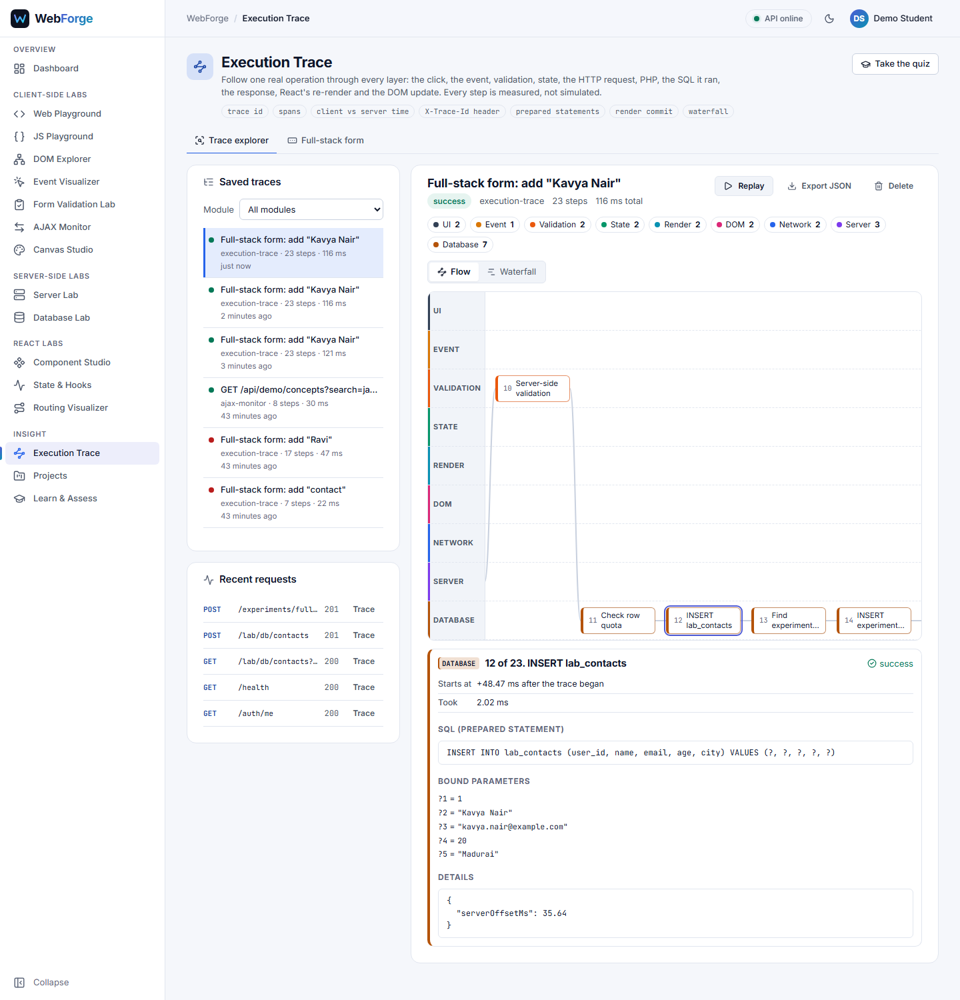
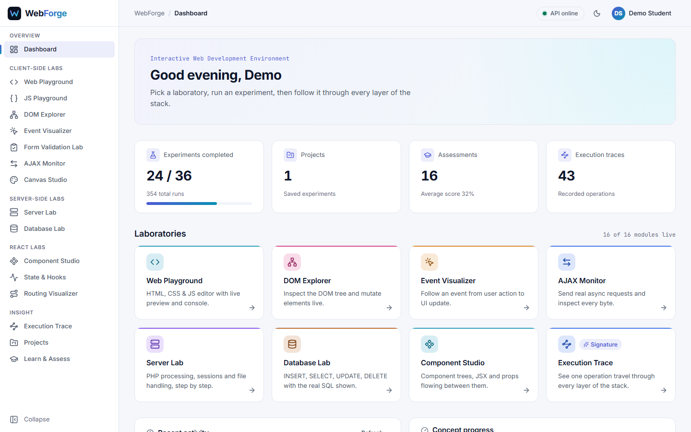
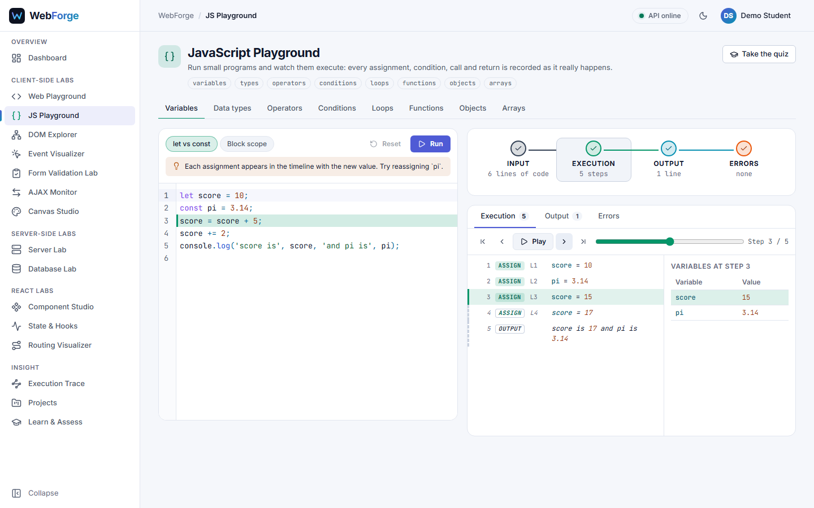
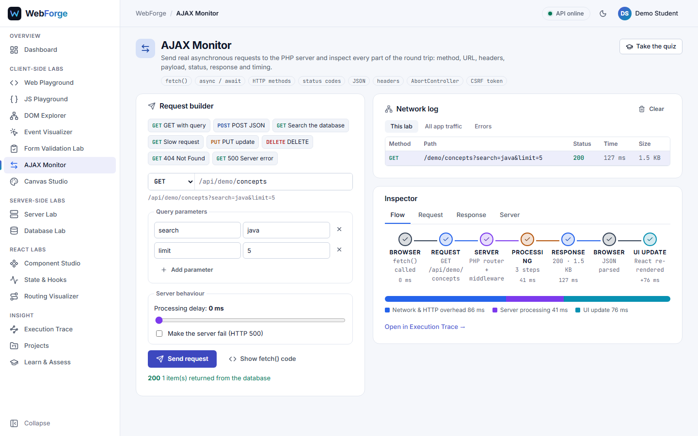
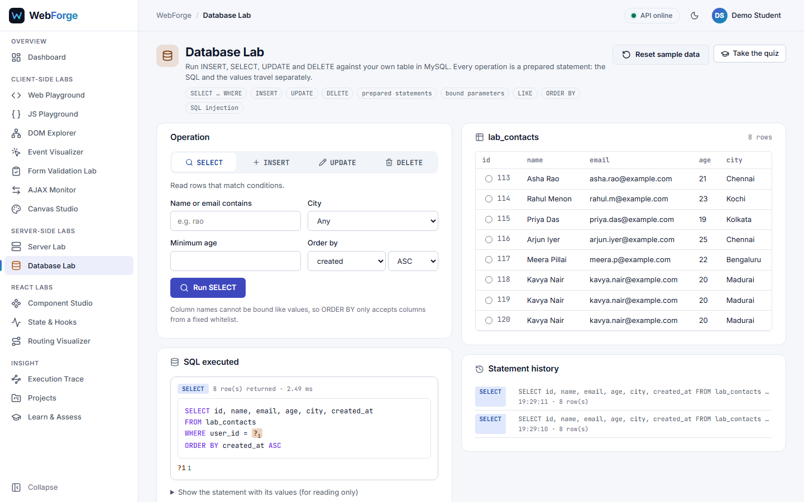
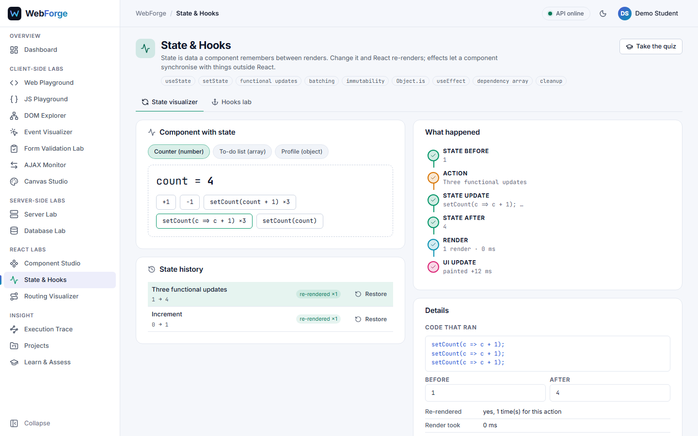
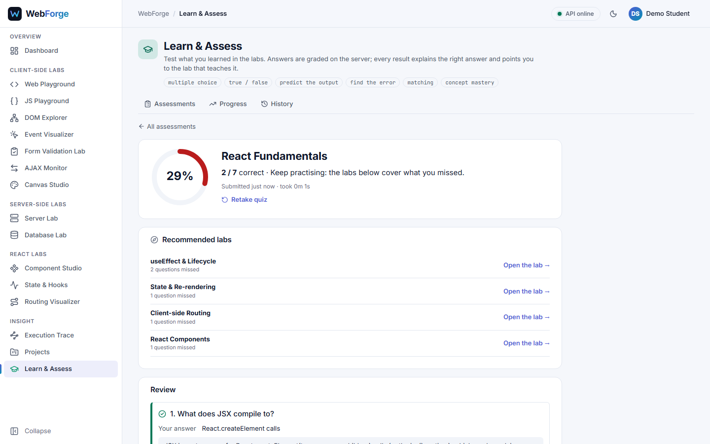

# WebForge

**An Interactive Web Development, Experimentation and Visualization Platform**

> *Don't just write web code. See how it works.*

WebForge is a browser-based laboratory for learning how the web really works. Students write and
run code, then watch it travel through every layer of the stack: HTML and the DOM, events, forms,
AJAX, PHP, sessions, files, SQL, and React components, state, hooks and routing.

Nothing is simulated. Code runs in a sandbox, requests reach a real PHP API, SQL runs on MySQL, and
every timing is measured. The signature feature, the **Execution Trace**, records one operation
from the user's click through validation, React state, HTTP, PHP and every SQL statement, and back
to the re-render, the DOM update and the paint.



## Features
| Area | Labs |
|---|---|
| **Client side** | **Web Playground** (HTML/CSS/JS editor, live preview, console, errors, device sizes) · **JS Playground** (step through execution with real values) · **DOM Explorer** (live tree, inspector, DOM APIs) · **Event Visualizer** (event pipeline from action to repaint) · **Form Validation Lab** (client vs server) · **AJAX Monitor** (requests, headers, timing, server steps) · **Canvas Studio** (Canvas 2D API, pointer events) |
| **Server side** | **Server Lab** (PHP experiments, form processing, sessions, file handling) · **Database Lab** (INSERT/SELECT/UPDATE/DELETE with the real prepared statements) |
| **React** | **Component Studio** (component tree, render reasons, JSX compiler, props flow) · **State & Hooks** (state updates, batching, effects and cleanups) · **Routing Visualizer** (route matching, params, guards, history) |
| **Insight** | **Execution Trace** (full-stack trace, flow and waterfall views, replay, export) · **Projects** (save and reopen work) · **Learn & Assess** (6 quizzes, server grading, concept mastery, history) |

| | | |
|---|---|---|
|  |  |  |
|  |  |  |

More in the [module guide](docs/modules.md).

## Technology
| Layer | Technology |
|---|---|
| Frontend | React 18, React Router 7, CodeMirror 6, Vite, CSS Modules (light and dark themes) |
| Backend | PHP 8.2, no framework, PDO with native prepared statements |
| Database | MySQL / MariaDB (XAMPP) |
| Testing | Vitest + Testing Library, Playwright + axe-core, a dependency-free PHP test harness |

## Quick start
Requires XAMPP 8.2 (Apache, MySQL, PHP) and Node.js 20+. Full instructions, including Apache
configuration and troubleshooting: **[docs/setup.md](docs/setup.md)**.

```powershell
# 1. Database (after adding backend/config/apache-webforge.conf to Apache)
copy backend\config\.env.example backend\config\.env
php backend\bin\setup.php

# 2. App in development
cd frontend
npm install
npm run dev                 # http://localhost:5173

# 3. Or the built app on Apache
npm run build:apache        # http://localhost/webforge/
```
Demo account: **demo@webforge.local / Demo@1234**

## Quality
- **151 automated tests:** 23 backend unit, 12 live API security, 62 frontend unit/component, 54
  end-to-end in a real browser against real PHP and MySQL. See [docs/testing.md](docs/testing.md).
- **Accessibility:** WCAG 2.1 AA with zero axe-core violations on every page in both themes;
  keyboard navigation, skip link, screen-reader labels; no sideways scrolling from 360 px.
- **Security:**
  - User code is sandboxed in iframes.
  - Every SQL query uses a prepared statement.
  - CSRF tokens, a hardened session, per-user data isolation, login throttling and rate limits.
  - Security headers on the API and the app.

  See [docs/security.md](docs/security.md).
- **Performance:** every lab is its own lazily loaded chunk; editor grammars load on demand; a
  JavaScript budget per page is enforced by a test.

## Documentation
| Document | Contents |
|---|---|
| [docs/setup.md](docs/setup.md) | Installation (everything on D:), configuration, deployment on Apache, tests, troubleshooting |
| [docs/modules.md](docs/modules.md) | What each lab teaches and how to use it, with screenshots |
| [docs/architecture.md](docs/architecture.md) | How the system is built: frontend, lab engines, Execution Trace, backend, data model, deployment |
| [docs/api.md](docs/api.md) | All 52 API endpoints, the response envelope, errors and limits |
| [docs/security.md](docs/security.md) | Threats, controls and how each is tested |
| [docs/testing.md](docs/testing.md) | The four test suites and what they cover |
| [docs/viva-notes.md](docs/viva-notes.md) | Demo script, likely questions and key numbers |
| [docs/design.md](docs/design.md) | The original design blueprint (before implementation) |

## Repository layout
```
frontend/    React app (Vite)
  src/         app/ (router, module registry) · layouts/ · pages/ · modules/ (one folder per lab)
               components/ · visualizers/ · editor/ · sandbox/ · trace/ · services/ · styles/
  e2e/         Playwright end-to-end tests
  scripts/     documentation screenshot generator
backend/     PHP API
  public/      the only web-visible folder (front controller)
  src/         Core/ (router, request, response, db, session, validator, tracer)
               Controllers/ · Services/ · Repositories/ · Experiments/ · routes.php
  tests/       unit and API security tests
  bin/         setup.php (database setup)
database/    schema.sql, seed.sql, upgrade scripts
docs/        documentation and screenshots
```
