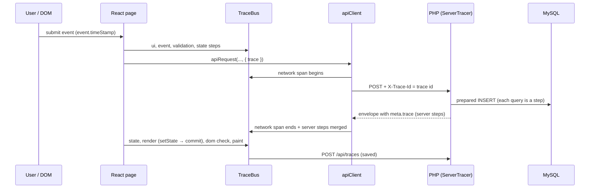
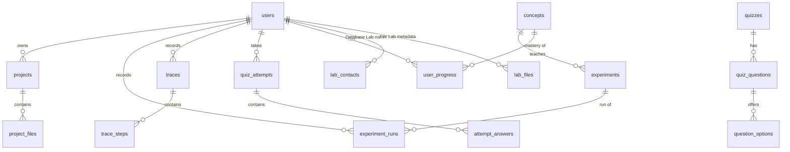

# WebForge Architecture (as built)

This describes the system as implemented. The original plan is in [design.md](design.md);
[the last section](#differences-from-the-original-design) lists where the build differs from it.

## 1. Overview

```
┌──────────────────────────── Browser ─────────────────────────────────────────┐
│ React 18 SPA (Vite build)                                                    │
│  AppShell: sidebar · top bar · <Outlet/>  ── 16 lazy-loaded modules           │
│  apiClient ──► networkLog (every request)      TraceBus (one trace per op)    │
│  Sandboxed <iframe srcdoc> per lab run  ◄── postMessage bridge (checked)      │
└──────────────┬───────────────────────────────────────────────────────────────┘
               │ same-origin JSON  (/api in dev · /webforge/api on Apache)
               │ session cookie + X-CSRF-Token + X-Trace-Id
┌──────────────▼───────────────────────────────────────────────────────────────┐
│ PHP 8.2 front controller  backend/public/index.php  (no framework)           │
│  Request → Router → session → CSRF → auth → release session lock             │
│  → Controller → Services/Repositories → PDO (prepared statements only)       │
│  ServerTracer records every step → response envelope meta.trace              │
└──────────────┬──────────────────────────────────────┬────────────────────────┘
               │ PDO, utf8mb4, emulation off          │ per-user folder
┌──────────────▼──────────────┐         ┌─────────────▼──────────────────────┐
│ MariaDB/MySQL  (webforge)   │         │ backend/storage/sandbox/{userId}/  │
└─────────────────────────────┘         └────────────────────────────────────┘
```

Code size: about 13,500 lines of JavaScript/JSX and 3,800 lines of PHP. No backend framework or
Composer packages; frontend runtime dependencies are React, React Router, CodeMirror 6, acorn
(+ acorn-jsx, acorn-walk), lucide-react icons and two self-hosted fonts.

## 2. Frontend

### Structure (`frontend/src`)
| Folder | Contents |
|---|---|
| `app/` | `App.jsx` (router, lazy routes), `modules.js` (the module registry), providers (theme, auth, toasts) |
| `layouts/` | `AppShell` (skip link, sidebar, top bar, `<main>`), `AuthLayout` |
| `pages/` | Dashboard, login/register, Projects, 404 |
| `modules/` | One folder per lab (web-playground, js-playground, dom-explorer, …, execution-trace, learn) |
| `components/` | UI kit (Button, Card, Modal, TextField, Badge, StateView, …), `LabHeader`, `SectionTabs`, route guards |
| `visualizers/` | `FlowPipeline` (stage diagram), `TreeView` (WAI-ARIA tree) |
| `editor/` | `CodeEditor` (CodeMirror 6; grammars loaded on first use) |
| `sandbox/` | `buildDocument`, bridge and inspector runtimes, `traceInstrument` |
| `trace/` | `traceBus.js` (client side of the Execution Trace) |
| `services/` | `apiClient`, `networkLog`, `projects`, `activity` |

### Module registry
`app/modules.js` is the single list of sections. It drives the sidebar, the dashboard
quick-launch, each lab's colour (`layer`) and the "Take the quiz" link in `LabHeader`
(its `quiz` field). Routes in `App.jsx` are `React.lazy` imports, so each lab is its own chunk.

### Talking to the API
`services/apiClient.js` is the only place that calls `fetch`:
- sends the session cookie, adds `X-CSRF-Token` to writes (refreshes it once on `CSRF_INVALID`) and an `X-Trace-Id`;
- unwraps the [response envelope](api.md#response-envelope) and throws `ApiError` (status, code, field messages);
- reports a lost login (`UNAUTHENTICATED`, `SESSION_EXPIRED`) to the auth provider, which sends the user to login;
- logs every request and response in `networkLog` (read by the AJAX Monitor and the Execution Trace);
- with a `trace` option, records the network step and merges the server's `meta.trace` (see §4).

### Design system
Plain CSS Modules with design tokens in `styles/tokens.css` (light and dark themes). Each layer
of the stack has a colour (`--layer-network`, `--layer-database`, …) used consistently in every
visualizer. Coloured text uses `color-mix(layer 65%, text)` so it keeps WCAG AA contrast in both themes.

## 3. Lab engines

### Sandboxed execution (Web Playground, JS Playground, DOM Explorer)
User code never runs in the app's own page. `sandbox/buildDocument.js` builds a complete HTML
document that is loaded with `<iframe srcdoc sandbox="allow-scripts allow-modals">`:
- no `allow-same-origin`, so the frame cannot read the app's cookies, storage or DOM;
- its own Content-Security-Policy (`connect-src 'none'`, `form-action 'none'`, `base-uri 'none'`);
- an injected bridge that forwards `console.*`, errors (with line numbers), timing and, in the
  DOM Explorer, a serialised DOM tree and MutationObserver records.

Messages are accepted only when `event.source` is that iframe's window and the run id matches;
the iframe only accepts commands from its parent.

### Execution recording (JS Playground)
`sandbox/traceInstrument.js` parses the program with acorn and inserts calls that report every
assignment, condition, loop iteration, call and return with real values, plus a loop guard against
infinite loops. The instrumented code runs in the sandbox; the timeline can be stepped forwards
and backwards with the variables at each step.

### JSX Playground
`modules/component-studio/jsx/jsxCompiler.js` parses JSX with acorn-jsx and accepts only a single
JSX expression checked against a whitelist: no statements, assignments, `new` or `this`; only the
example's own variables plus `Math`, `NaN`, `Infinity`; no dangerous tags (`<script>`, `<iframe>`,
`<form>`, …), attributes (`dangerouslySetInnerHTML`, `ref`, `srcDoc`) or properties (`constructor`,
`__proto__`, …). It then generates `React.createElement` calls. The page shows the source, the compiled code, the element object tree
and the rendered result.

### Component, state and routing inspectors
- **Component Studio**: demo components are wrapped by `inspectable()`, which records each render,
  its props, its state (`useInspectableState`) and the reason it re-rendered.
- **State & Hooks**: `useActionRecorder` snapshots state before and after an action, measures the
  render (setState → commit in `useLayoutEffect`) and the next paint, and detects React's bail-out
  (`Object.is`).
- **Routing Visualizer**: a real React Router app runs in its own React root with
  `createMemoryRouter`; `router.subscribe` reports each navigation, match, redirect and history action.

## 4. The Execution Trace



- A trace is an object (`createTrace`) holding timed steps relative to its start (`performance.now()`).
  Steps are recorded as things happen: the submit event's own timestamp, the validation run,
  `setState`, the render measured to the layout-effect commit, a check that the new table row is in
  the DOM, and the next animation frame.
- The browser and PHP have separate clocks. Server steps are placed inside the network span,
  centred (the gap either side is the HTTP overhead each way); each keeps its real server offset in
  `detail.serverOffsetMs`. This is stated in the UI rather than hidden.
- Any request in `networkLog` can also become a trace ("Recent requests" → Trace, or "Open in
  Execution Trace" in the AJAX Monitor).
- Traces are stored in `traces` / `trace_steps` and shown as a swimlane flow (one lane per layer)
  or a waterfall, with replay, step details (SQL and bound parameters, headers, bodies, state
  before/after) and JSON export.

## 5. Backend

### Request pipeline (`backend/public/index.php`)
1. `Request::fromGlobals` (3 MB body limit) and a `ServerTracer` (reuses a valid `X-Trace-Id`).
2. `Router::match`: `{param}` patterns; 404 vs 405.
3. Middleware: start the session (unless the route is stateless) → verify CSRF on every non-GET
   request → require login on `auth` routes.
4. Release the session lock (`session_write_close`) unless the route writes to the session, so a
   slow request never blocks the user's other requests.
5. Controller → `Response` envelope. `HttpException` becomes a structured error; database and
   unexpected errors are logged and returned without internals outside development.

### Main classes
| Class | Responsibility |
|---|---|
| `Core\Db` | PDO wrapper: native prepared statements only; every query is a traced step with its SQL and parameters |
| `Core\Validator` | Declarative rules (`required`, `email`, `min`, `between`, `in`, `name`, `password`, …); returns whitelisted, trimmed values or a 422 with per-field messages |
| `Core\Session` | Hardened cookie session: strict mode, HttpOnly, SameSite=Lax, id regeneration on login, idle timeout, CSRF token |
| `Core\ServerTracer` | Records steps and exports them in `meta.trace` |
| `Services\ProgressService` | Recomputes concept mastery from experiments and latest quiz answers |
| `Services\QuizGrader` | Pure grading for all five question types |
| `Services\RateLimiter` | Sliding-window limits backed by `rate_limit_hits` |
| `Services\ActivityService` | Records experiment runs |
| `Controllers\*` | One per area (Auth, Stats, Project, Demo, FormLab, ServerLab, SessionLab, FileLab, DbLab, Trace, Quiz, Learn, Experiment) |

### Server Lab safety
The Server Lab never evaluates user code. Each experiment is a fixed PHP class
(`backend/src/Experiments/`) that takes validated inputs and returns its output and steps; the
source shown in the editor is that class's real code. The Session Demonstrator uses a separate
cookie (`WEBFORGE_LAB_SID`) so experimenting with it never affects the WebForge login.

## 6. Data model



Plus `login_attempts` (login throttling) and `rate_limit_hits` (rate limits). Full definitions:
[`database/schema.sql`](../database/schema.sql). The seed adds 20 concepts, 36 experiments,
6 quizzes and 39 questions. Answer keys (`question_options.is_correct`, `quiz_questions.payload_json`)
never leave the server before grading.

**Concept mastery** (0–100): the share of a concept's experiments completed successfully, and the
share of its quiz questions whose latest answer is correct; each counts half when both exist.

## 7. Deployment

| | Development | Apache (demo / production) |
|---|---|---|
| App | `npm run dev` → http://localhost:5173 | `npm run build:apache` → `frontend/dist-apache`, served at http://localhost/webforge/ |
| API | Vite proxies `/api` → `/webforge/api` | `/webforge/api` (Apache Alias → `backend/public`) |
| Origin | same (proxy) | same (one Apache) |

`npm run build` + `npm run preview` (port 4173) serves the production build with the same proxy;
the automated tests run against it. Apache config: [`backend/config/apache-webforge.conf`](../backend/config/apache-webforge.conf).
Security headers for the app are in `frontend/public/.htaccess` (copied into the build).

## Differences from the original design

| Planned ([design.md](design.md)) | Built | Why |
|---|---|---|
| Sucrase to compile JSX | acorn-jsx + own code generator with a whitelist | Smaller, and lets the playground reject unsafe constructs and explain each step |
| Traces from hooks such as `useTracedState` | An explicit trace object per operation | Every step is measured exactly where it happens; nothing is inferred |
| PHPUnit for backend tests | A dependency-free PHP test harness | No Composer needed on the lab machines |
| API under `/webforge/api` only | API at `/webforge/api` and the built app at `/webforge/` | One origin in production, no CORS |
| (not planned) | Rate limiting table and service | Registration and write endpoints needed abuse limits |
| (not planned) | Concept mastery engine | `user_progress` needed a real, explainable source |
| Ctrl+K command palette | Not built | Out of scope for the time available |
| Comparing two traces | Not built | Same; export to JSON is provided instead |
| Admin role for quiz authoring | Not built | Quizzes are maintained in `database/seed.sql` |
| "View trace" in every module | AJAX Monitor link + "Recent requests" capture for any API call | Covers every module's server calls without per-module code |
