# Module Guide

WebForge has 16 sections. Every lab shows **real** behaviour: code really runs, requests really reach
PHP, SQL really executes, and every timing is measured. Each lab header lists the concepts it covers
and links to the related quiz.

| Section | Teaches | Screenshot |
|---|---|---|
| [Dashboard](#dashboard) | Your progress at a glance | [01](screenshots/01-dashboard.png) |
| [Web Playground](#web-playground) | HTML, CSS, JS, the browser console | [02](screenshots/02-web-playground.png) |
| [JS Playground](#js-playground) | How JavaScript executes, step by step | [03](screenshots/03-js-playground.png) |
| [DOM Explorer](#dom-explorer) | The DOM tree and DOM APIs | [04](screenshots/04-dom-explorer.png) |
| [Event Visualizer](#event-visualizer) | Events from action to repaint | [05](screenshots/05-event-visualizer.png) |
| [Form Validation Lab](#form-validation-lab) | Client vs server validation | [06](screenshots/06-form-lab.png) |
| [AJAX Monitor](#ajax-monitor) | fetch, HTTP methods, status codes | [07](screenshots/07-ajax-monitor.png) |
| [Canvas Studio](#canvas-studio) | Canvas 2D API, pointer events | [08](screenshots/08-canvas-studio.png) |
| [Server Lab](#server-lab) | PHP, forms, sessions, files | [09](screenshots/09-server-lab.png) |
| [Database Lab](#database-lab) | SQL CRUD, prepared statements | [10](screenshots/10-database-lab.png) |
| [Component Studio](#component-studio) | Components, JSX, props | [11](screenshots/11-component-studio.png), [12](screenshots/12-jsx-playground.png) |
| [State & Hooks](#state--hooks) | useState, useEffect | [13](screenshots/13-state-visualizer.png), [14](screenshots/14-hooks-lab.png) |
| [Routing Visualizer](#routing-visualizer) | Client-side routing | [15](screenshots/15-routing-visualizer.png) |
| [Execution Trace](#execution-trace) | One operation through every layer | [16](screenshots/16-execution-trace-form.png), [17](screenshots/17-execution-trace-flow.png), [18](screenshots/18-execution-trace-waterfall.png) |
| [Projects](#projects) | Saving and reopening work | [19](screenshots/19-projects.png) |
| [Learn & Assess](#learn--assess) | Quizzes, progress, history | [20](screenshots/20-quiz.png), [21](screenshots/21-quiz-result.png), [22](screenshots/22-progress.png) |

---

## Dashboard
Experiments completed, projects, assessments with average score, recorded traces, concept mastery by
category, recent activity, projects and traces. All figures come from your own data.

## Web Playground
Edit `index.html`, `style.css` and `script.js`; press **Run** (Ctrl+Enter) or turn on auto-run.
The preview runs in a sandbox; the **Console** shows real `console` output and the **Errors** panel
shows syntax and runtime errors with clickable line numbers. Switch between desktop, tablet and
phone sizes. **Save** (Ctrl+S) stores the files as a project; unsaved changes are protected.
**Inspect DOM** opens the current page in the DOM Explorer.

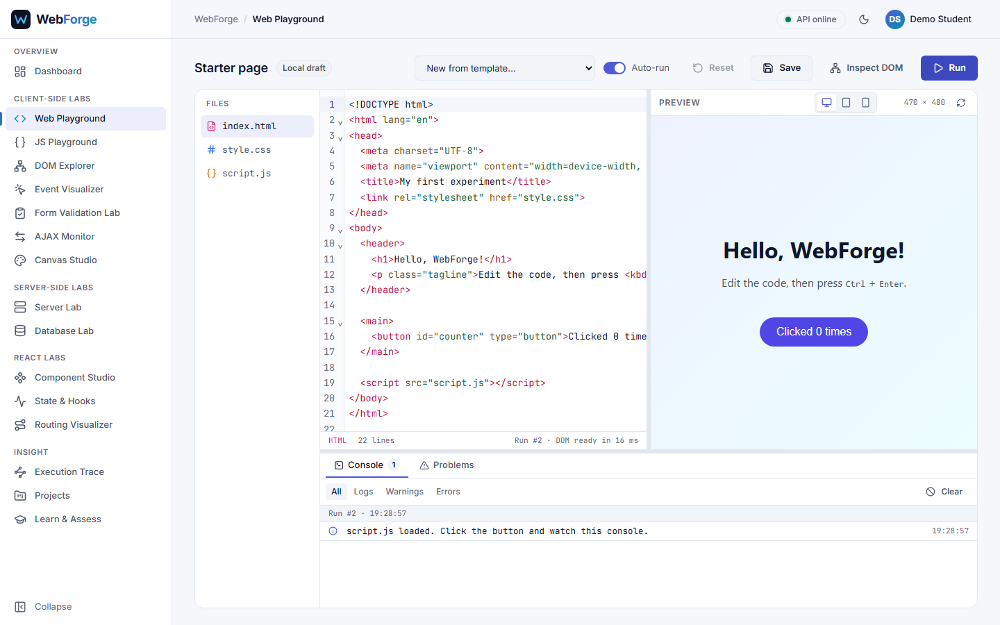

## JS Playground
Eight topics (variables, data types, operators, conditions, loops, functions, objects, arrays) with
editable examples. **Run** records every assignment, condition, loop check, call and return with its
real value. Step through the timeline with the player and watch the variables change; output and
errors are shown separately. Infinite loops are stopped by a guard.

## DOM Explorer
Loads a sample page (or your Web Playground page) and shows its live DOM tree. **Pick element** and
click in the page, or select a node in the tree, to see its tag, attributes, classes, computed
styles, parent and children. Change text, HTML, styles or classes, add or remove elements: the
inspector shows the exact DOM API call and the mutations it caused.

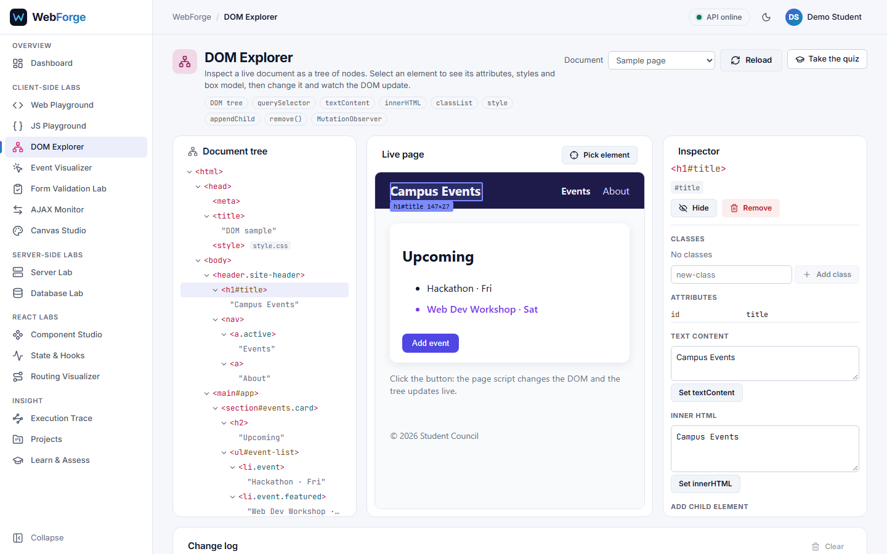

## Event Visualizer
Interact with real elements (click, double-click, hover, keys, input, change, submit). Each event is
traced as a pipeline: user action → event object → propagation → listener → handler → DOM change →
repaint, with the real event properties and timings. Choose which event types to record; the history lists every recorded event.

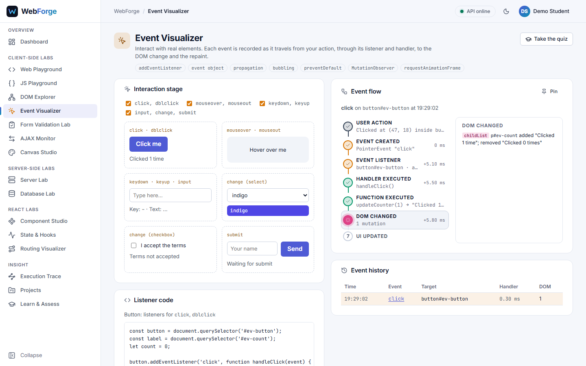

## Form Validation Lab
A registration form validated twice: by the browser (each rule shown as it passes or fails) and by
PHP (rule-by-rule report, plus a database check that the email is not taken). Presets show data that
is valid, invalid, or passes the client but fails the server, which is why the server must always validate.

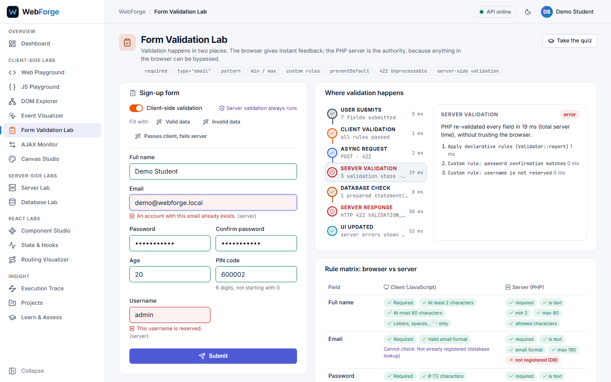

## AJAX Monitor
Build a request (method, path, query, JSON body) or pick a preset, then send it to real demo
endpoints. The network log shows status, size and time; the details show request and response
headers and bodies, the 7-step round trip, and the server's own steps (including SQL). Add a real
delay, force a server error, or cancel a slow request. **All app traffic** shows WebForge's own requests.

## Canvas Studio
Pencil, line, rectangle, circle and eraser with colour and size; Shift constrains shapes. Every
stroke is an operation, so undo/redo is exact. Panels show the pointer events received and the
Canvas API calls that drew the last shape. Download as PNG or save the drawing as a project.

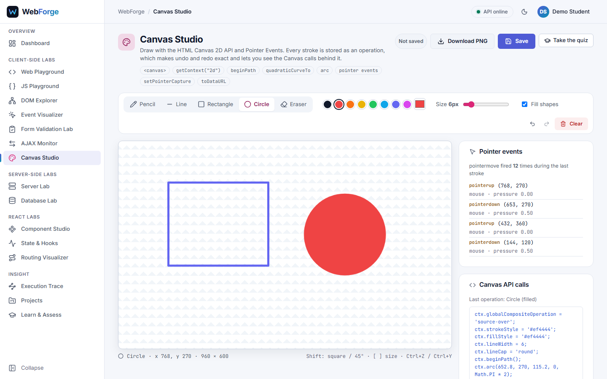

## Server Lab
Four parts:
- **PHP experiments**: variables, operators, conditions, loops, arrays, strings and functions. Change
  the inputs and run the real PHP; see the output and each processing step next to the source code.
- **Form processing**: submit a form to PHP and follow receive → trim → validate → escape
  (`htmlspecialchars`) → respond. Try the XSS preset.
- **Sessions**: a separate demo session. Log in, open a members-only page, store `$_SESSION` data, log out.
- **File handling**: create, write, append, read and delete text files in your own server folder,
  with the PHP functions and file modes shown.

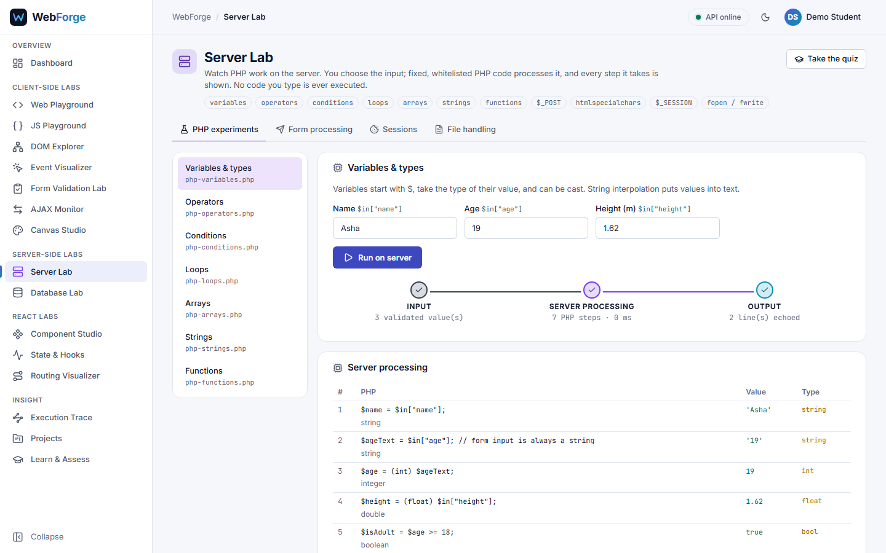

## Database Lab
Run INSERT, SELECT (search, filters, sorting), UPDATE and DELETE on your own `lab_contacts` table.
The SQL panel shows the real prepared statement, the bound parameters, rows affected and time.
**Reset sample data** restores five sample rows.

## Component Studio
- **Component tree**: a small live React app. Select a component to see its props, state, parent,
  children and renders; the render log explains why each re-render happened (state, props, parent).
- **JSX playground**: seven lessons. Edit JSX and see the compiled `React.createElement` calls, the
  element object tree and the rendered result. Save your version as a project.
- **Props visualizer**: change a parent's state and watch props flow to the children, and callbacks flow up.

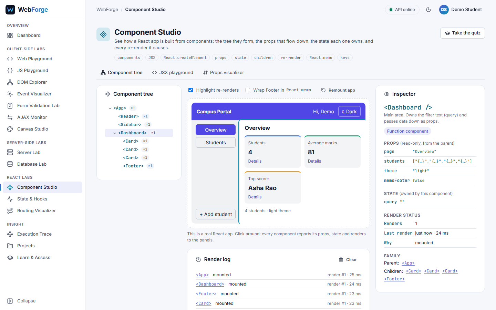

## State & Hooks
- **State visualizer**: a counter, a to-do list and a profile object. Each action is shown as
  state before → action → update → state after → render → UI, with the real values and timings.
  Includes batching (`setCount(count + 1)` three times adds 1), functional updates, React skipping a
  render for the same value, and mutation mistakes that do not re-render. Restore any earlier state.
- **Hooks lab**: mount/unmount a component, change its `userId` prop, re-render its parent, start a
  timer. The timeline logs each effect, cleanup, aborted request and committed render.

## Routing Visualizer
A real React Router app with an address bar and back/forward. Navigate by links, address bar or
history; see the route matched (including nested routes), URL params, a protected route that
redirects to login, a 404 route, and the history stack (PUSH, REPLACE, POP).

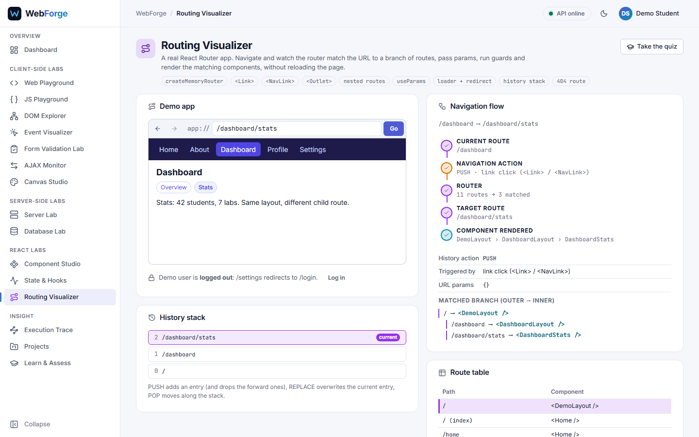

## Execution Trace
The signature feature.
- **Full-stack form**: submit a contact form and see every layer recorded as it happens: click,
  submit event, client validation, `setState`, the HTTP request, PHP routing and validation, each SQL
  statement with its values, the response, the re-render, the DOM update and the browser paint.
  Tick "skip client-side validation" to watch the server reject bad data instead.
- **Trace explorer**: saved traces (filter by module), a swimlane **Flow** view (one lane per layer)
  and a **Waterfall** timeline, replay, step details, JSON export and delete. Any recent API request
  from any lab can be turned into a trace.

## Projects
Everything saved from the Web Playground, Canvas Studio and the JSX Playground. Search, filter by
type, open in its lab, rename or delete. **New project** starts from real starter content.

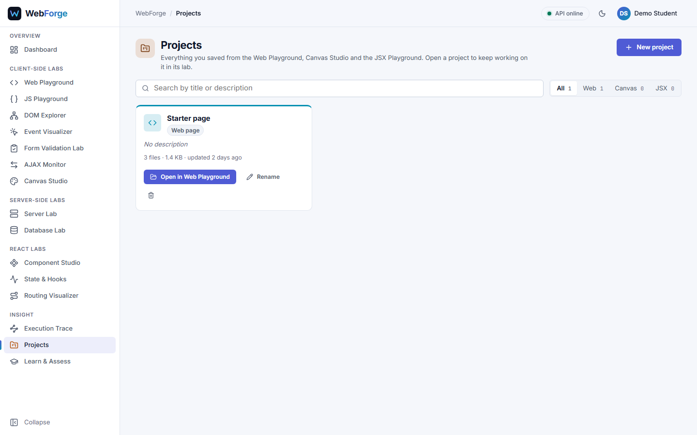

## Learn & Assess
- **Assessments**: six quizzes (39 questions) with five question types: multiple choice, true/false,
  predict the output, find the error and matching. Answers are graded on the server; the result
  explains each answer and recommends the labs that teach what you missed.
- **Progress**: mastery for each of the 20 concepts (from experiments completed and the latest
  quiz answers), with a link to practise each one.
- **History**: everything you did (experiments, assessments, projects, traces), filterable.

## Phone and dark theme
Every page works from 360 px wide (the sidebar becomes a drawer) and in both themes.

| Phone | Dark |
|---|---|
| 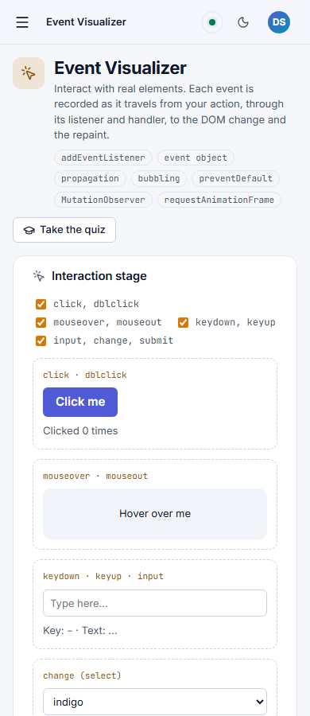 | 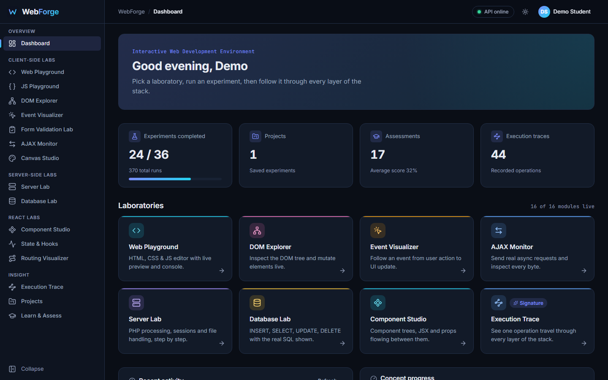 |
